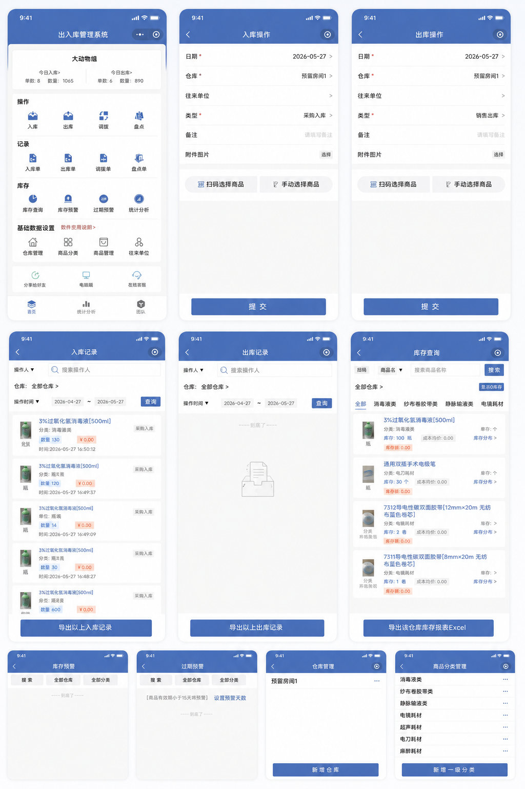
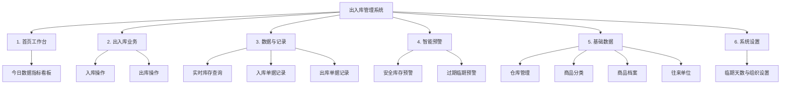

# 出入库管理系统 - 功能规格说明书

本说明书详细介绍了“出入库管理系统”的功能模块、核心业务流程和技术架构。该系统为一款轻量级、跨平台的仓库库存管理解决方案，支持移动端和Web端访问，主要用于库存的日常流转、预警以及基础数据维护。

---

## 1. 原型图展示

以下是本系统的原型图设计。在开发和迭代过程中，界面设计和交互模式均以此原型图为基准进行开发。

---

## 2. 系统核心功能架构

---

## 3. 功能模块详细说明

### 3.1 首页工作台 (Dashboard)
首页为系统的核心控制台，提供快速入口和数据汇总看板：
*   **今日数据统计**：
    *   **今日入库**：实时展示今日累计入库的“单数”及累计入库的“商品总件数”。
    *   **今日出库**：实时展示今日累计出库的“单数”及累计出库的“商品总件数”。
*   **常用功能网格 (Icon Grid)**：
    *   提供出入库操作、记录查看、库存查询和基础数据设置的快捷直达入口。
    *   包含针对未来规划功能的占位（如调拨、盘点等），便于后续扩展。

### 3.2 出入库业务模块 (Transactions)
*   **入库操作 (Stock In)**：
    *   **商品选择**：支持通过搜索条码或商品名称模糊匹配选择入库商品。
    *   **关键字段**：可录入入库仓库、往来单位（供应商）、入库价格、入库数量、操作员及入库类型（如采购入库、调拨入库等）。
    *   **附件录入**：支持备注说明及现场照片上传（用于移动端拍照留存凭证）。
*   **出库操作 (Stock Out)**：
    *   **商品选择**：选择出库仓库和对应的出库商品（自动显示当前可用库存）。
    *   **关键字段**：可录入出库数量、出库价格、操作员及出库类型（如销售出库、领用出库等）。
    *   **控制机制**：当出库数量大于仓库当前可用库存时，系统会予以提示，防止出现负库存（取决于配置）。

### 3.3 数据与记录查询 (Data & Records)
*   **实时库存查询 (Inventory Query)**：
    *   系统基于出入库历史记录自动实时计算当前净库存。
    *   **过滤条件**：支持按仓库名称、商品分类、条码/名称关键词进行组合筛选。
    *   **数据维度**：展示商品名称、当前库存量、安全库存、单位、平均成本、总库存金额等关键商业数据。
*   **单据记录管理 (Order History)**：
    *   **入库单记录**与**出库单记录**独立管理。
    *   支持按仓库、操作员和自定义日期区间进行多条件检索。
    *   提供单据详情页面，可完整复盘当时的操作明细、往来单位、商品列表及备注照片。

### 3.4 智能库存预警 (Smart Alerts)
*   **库存不足预警 (Low Stock Alert)**：
    *   当商品的实时库存数量低于其预设的“安全库存（minStock）”时，自动列入预警看板，提醒管理员及时补货。
*   **过期临期预警 (Expiry Date Alert)**：
    *   根据商品档案中录入的保质期/失效日期，自动计算当前距离过期剩余的天数。
    *   系统依据“临期提醒天数”的设定，对即将过期或已过期的商品进行高亮红色预警，降低过期库存损耗风险。

### 3.5 基础数据管理 (Master Data)
作为出入库系统的基石，提供以下模块的录入与增删改查：
*   **仓库管理**：定义不同的物理或逻辑储存空间（如：预留房间1、主仓库等）。
*   **商品分类**：多级或单级分类结构（如：消毒液类、纱布卷胶带类、电镐耗材等）。
*   **商品档案**：录入商品的核心规格，包括：名称、条形码、单位、安全库存、规格、货号、生产厂家、失效日期等。
*   **往来单位**：维护供应商及客户的联系档案，便于追踪出入库货源。

---

## 4. 技术特性与存储机制

1.  **极速离线存储 (LocalStorage)**：
    *   系统数据完全存储在本地浏览器的 `localStorage` 中。
    *   在没有网络连接的情况下，用户依然可以进行出入库录入、库存查询等全部核心操作，数据将在本地即时持久化。
2.  **Cordova/Capacitor 移动适配**：
    *   页面设计采用标准的 Web 视口自适应方案，对移动端设备有良好的手势支持与头部/底部状态栏避让（`viewport-fit=cover`）。
    *   支持原生打包为 Android APK 或 iOS App 运行。
